# Đây là sản phẩm thiết kế ứng dụng nấu ăn FACU .

*link sản phẩm https://www.figma.com/file/aK0blCRUnXHGxr02RhaTY3/CANH-PHU?node-id=156%3A61*

*liên kết nhanh*

[1. Giới thiệu khái quát về sản phẩm  ](#Modau)

[2. Giới thiệu các trang ](#sudungct)

[3. Cuối trang ](#h)

  
    1.Giới thiệu khái quát về sản phẩm 

1.1 Giới thiệu về Facu

Nếu bạn là người ham học hỏi trong nấu nướng, hay bạn muốn chia sẻ kinh nghiệm nấu nướng của mình đến cho mọi người  ứng dụng này là tiện ích dành cho bạn. Đây tựa như trang xã hội nơi chia sẻ các kinh nghiệm và công thức nấu ăn công khai cho mọi  thành viên. bạn có thể tìm kiếm  thanh công cụ tìm kiếm, bạn nhập tên nguyên liệu, tên món ăn sẽ chỉ ra các công thức và các món khác nhau để bạn áp dụng. Hình ảnh sẽ được thành viên up lên  một cách chân thực nhất và chi tiết các bước thực hiện ra món ăn đó. Vâng ứng dụng mình muốn giới thiệu ở đây kà ứng dụng Facu.

1.2   Các thuộc tính sử dụng trong ứng dụng

Kiểu chữ được sử dụng trong ứng dụng
Ở đây font chữ được sử dụng là inter
Kiểu chữ được sử dụng là Bold và medium
Size chữ từ 22px, 17px ,15px ,  12 px .

* Màu chữ 

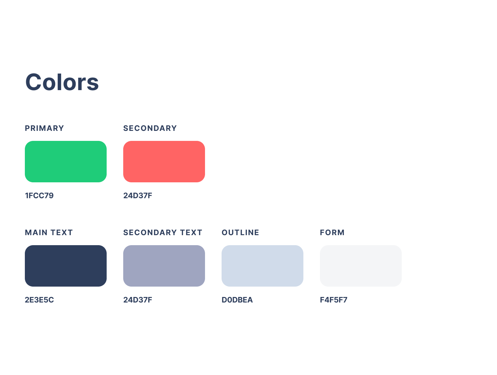

* logo sản phẩm
 
 

    2.Giới thiệu các trang                                                                                                         
 
 
* GIAO DIỆN  ỨNG DỤNG FACU

 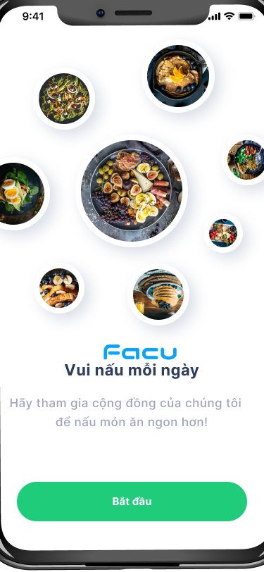

Trang  mở đầu của Ứng dụng  với giao diện nhìn bắt mắt người dùng với màu trắng đơn điệu hi vọng người dùng sẽ.

* ĐĂNG NHẬP & BẢO MẬT

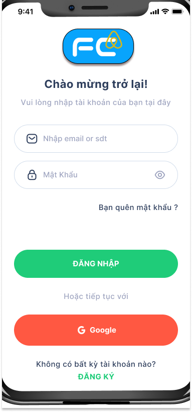

Người dùng đăng nhập tài khoản để có thể sử dụng được ứng dụng FACU từ tài khoản đã đăng ký trước hoặc có thể đăng nhập với tài khoản Google của mình.

 
Nhập code để đăng nhập

  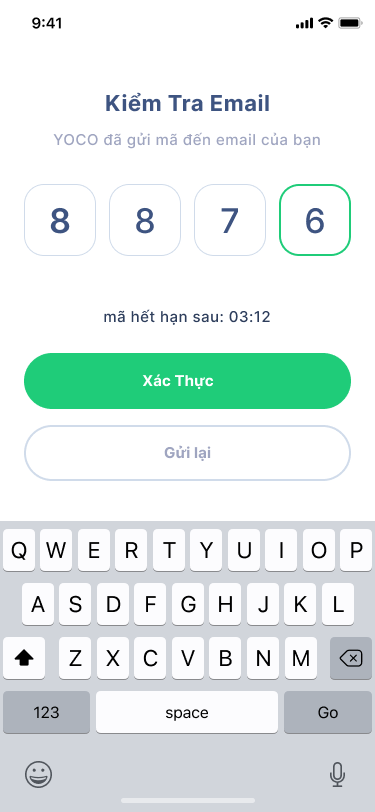
 
Sau khi đăng nhập bằng tài khoản mật khẩu người dùng cần phải nhập thêm mã do hệ thống máy chủ FACU gửi về người dùng và nhập vào để đăng nhập thành công.
 
  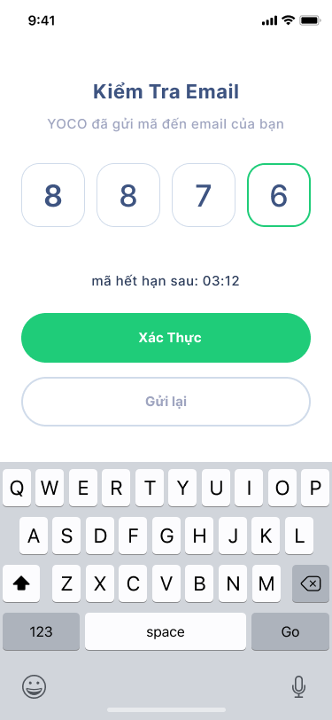
 
Ở phần mật khẩu  ta thêm ký tự dấu chấm đậm ẩn và tắt mắt để cho khách hàng có thể thấy được .

 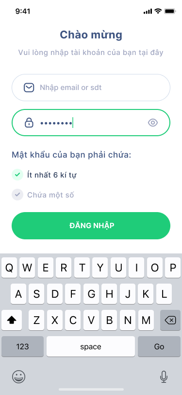

 
Khi bạn quên mật khẩu thì phải làm sao nhỉ ?

Chúng ta ấn vào quên mật khẩu và nhập đúng email của mình vào và tìm kiếm nếu đúng  như tìm kiếm thì sẽ có mã gửi về và nhập vào ra màn hình nhập mật khẩu mới với yêu cầu mật khẩu chứa các yêu cầu đề ra.

* Trang chủ
 
  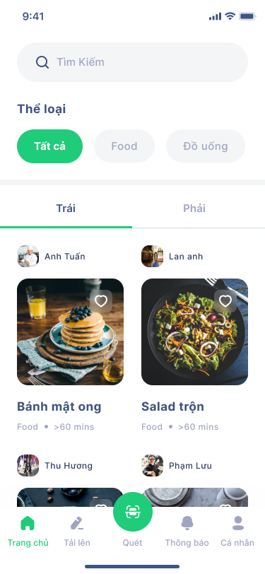
  
Bước vào giao diện Trang chủ sau khi đăng nhập thành công hệ thống, chúng ta bắt đầu sử dụng ứng dụng nào.

Ở trang chủ có thể tìm kiếm và bản tin các món ăn cập nhập do ứng dụng đề xuất và từ các bếp bạn theo dõi.
 
 
* Tìm kiếm

 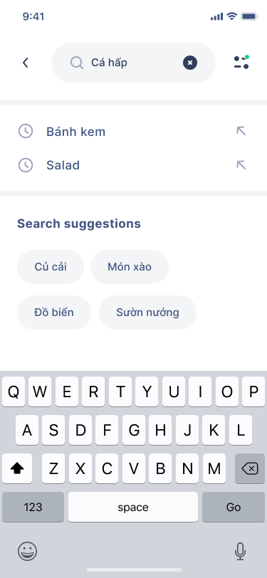

Ứng dụng cho phép người dùng tìm kiếm những món ăn bạn muốn bằng các từ khóa liên quan.

Có thể lọc để ra kết quả tìm kiếm được như ý hơn, ở đây có thể lọc ra thể loại, thời gian nấu nướng .
 
  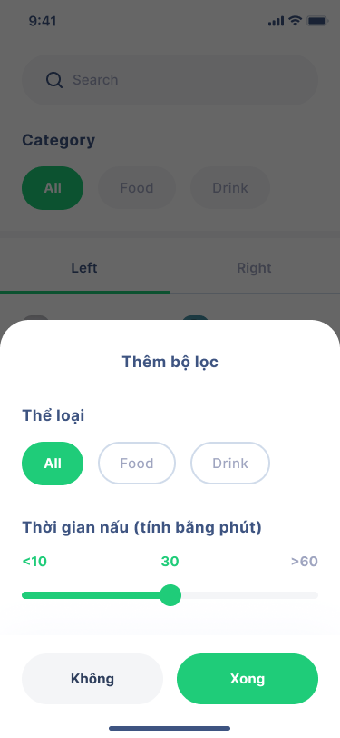
 
* Nhập tìm kiếm

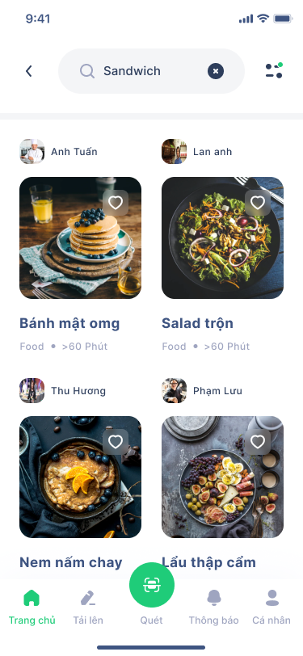

Màn hình khi tìm kiếm kết quả
 
 
* Đăng món ăn

 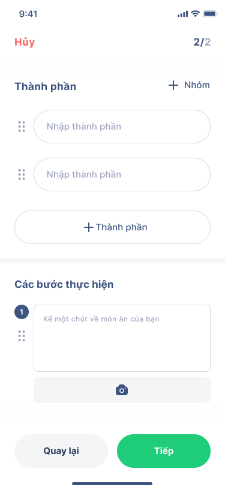

Bạn muốn đăng 1 công thức chế biến món ăn đến mọi người cùng đến đến đây.

Người dùng có thêm nhiều ảnh tùy chọn tối đa là kích thước định sẵn, và giới thiệu tên món ăn của mình.

Và có thể chia sẽ hay tâm sự của mình về món ăn đó, hay tâm trạng của mình điều mình muốn nói.

Lựa chọn thời gian nấu món ăn.

 
Nhập thêm thông tin về món ăn thành phần, và các bước thực hiện có thể bao gồm ảnh người dùng có thể đăng món ăn, lúc đó sẽ thông báo kết quả tải lên thành công.
 
  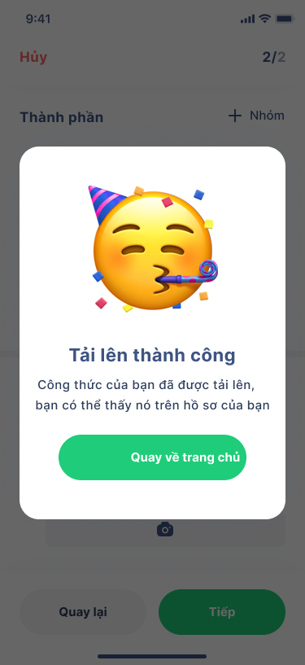
 
* Quét món ăn

Ở đây chúng tôi cung cấp cho người dùng tính năng quét để nhận diện món ăn đó là món gì thành phần gì và cho kết quả nhưng món ăn tương tự.
 
  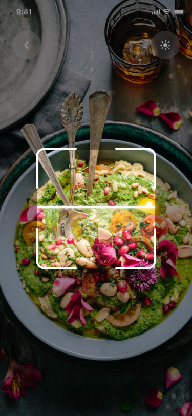
 
* Thông báo

Hiển thị những thông báo như những người theo dõi bạn hay yêu thích hay những thông báo khác đến bạn được hiển thị ở đây.

  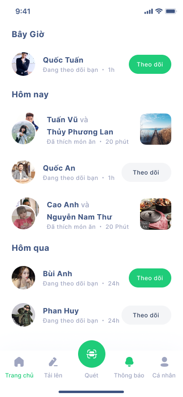
 
* Trang cá nhân

 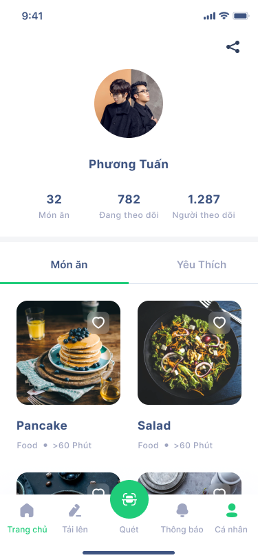
 
 *Trang cá nhân của người khác
 
  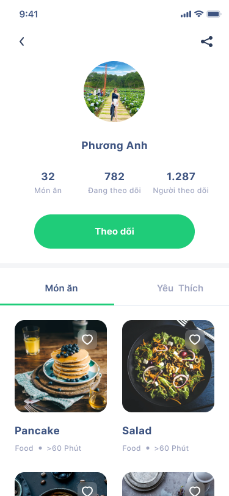
 
Ở đây bạn sẽ thấy thông tin về tài khoản của mình.  Bạn xem được những nhật ký món ăn của mình số người đang theo dõi, bạn đang theo dõi những bếp nào, cũng xem được những món ăn bạn để ý yêu thích ở mục yêu thích.
 

Cảm ơn bạn đã theo dõi giới thiệu về thiết kế ứng dụng nấu nướng của nhóm mình , phần quy trình thiết kế mình sẽ giới thiệu và cập nhật sau .
